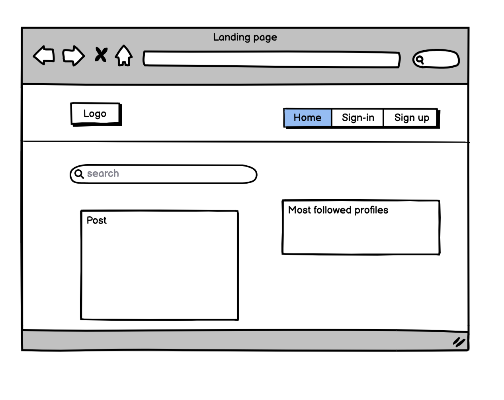
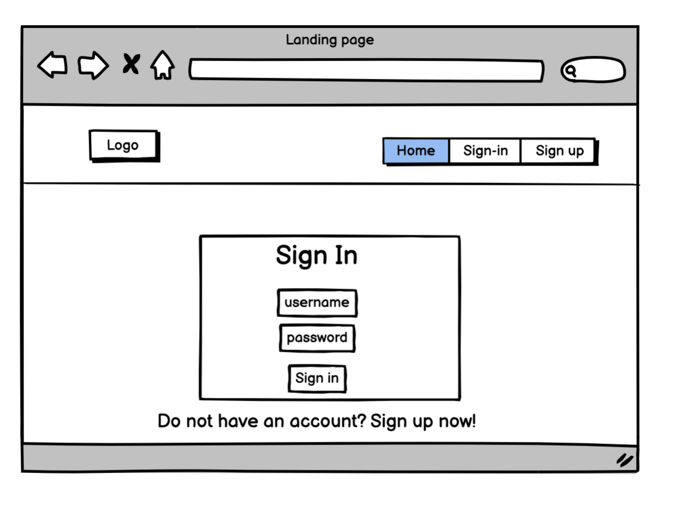
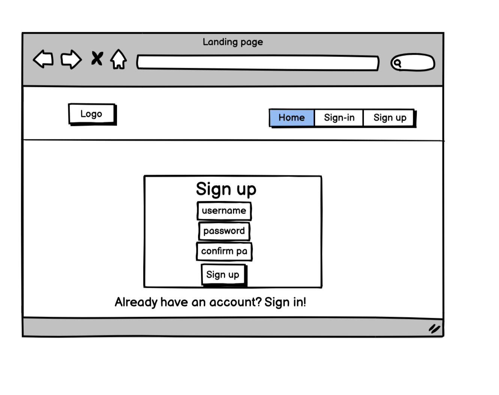
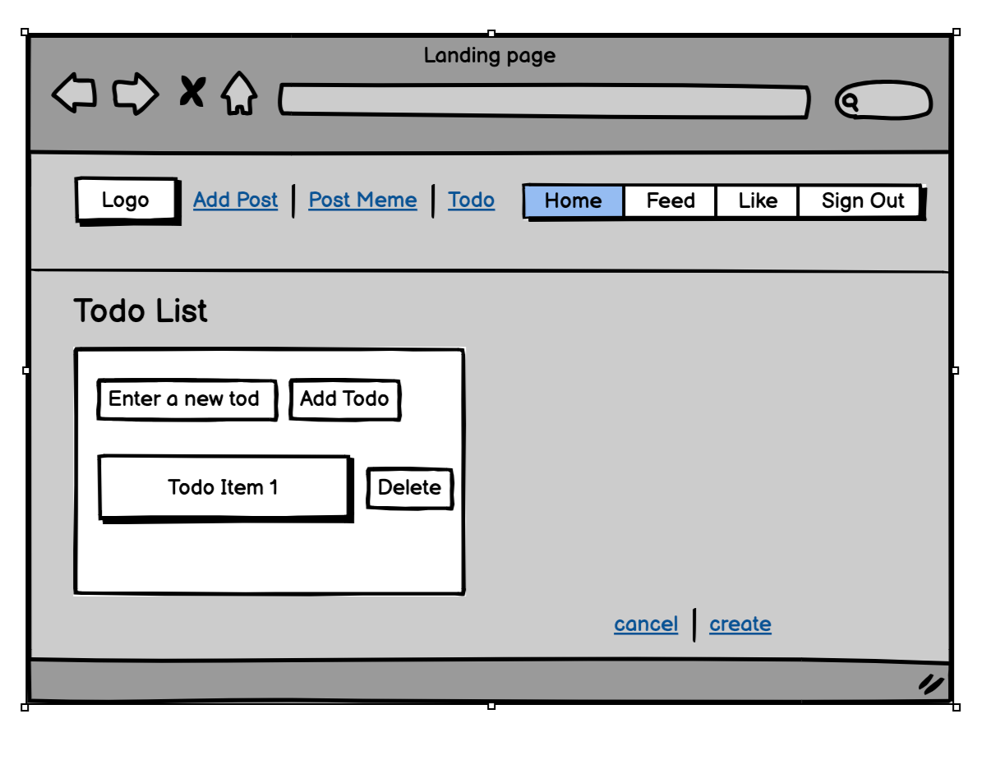
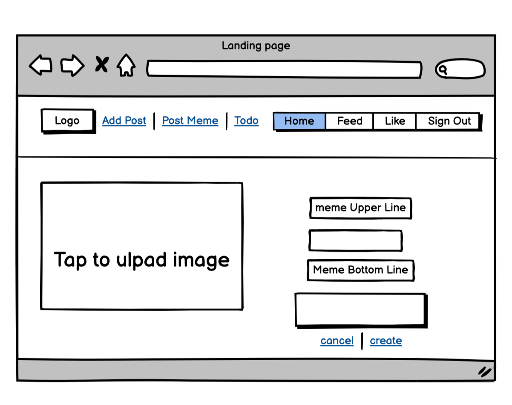
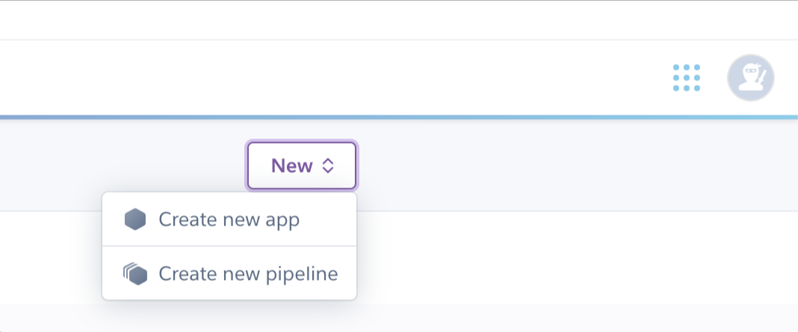
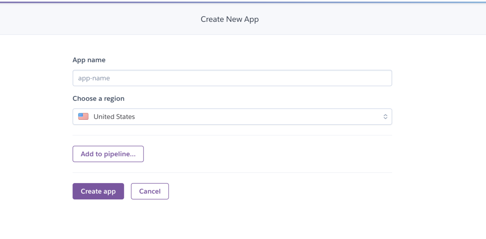
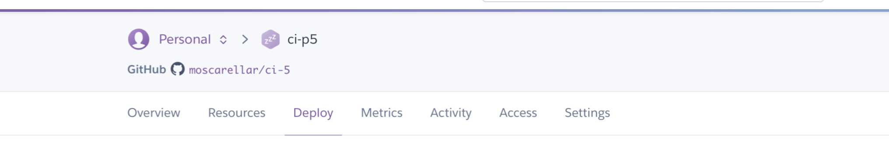
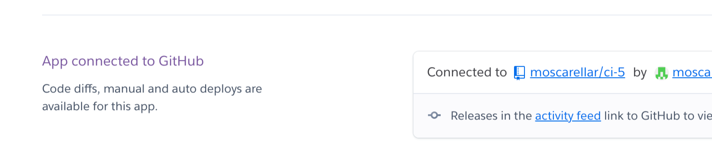

# MyFilmApp - Frontend React application [Live link](https://ci-p5.herokuapp.com/)

MyFilmApp is a website developed in order to share interesting material about films. However, today, it turned to be a big sharing platform.

# Project Goals

The goal for this project was to work on Project Example Idea 1: Content platform, which includes all the basic functionality in order for potential visitors to start using the website in its intended way. These features include:

- The platform should enable users to CRUD and vote.
- Content should be searchable.
- Search results can be filtered on hashtags.
- Authentication/authorization functionality
- easy and clear navigation within the whole page
- possibility to change profile information (bio text, image)

# User Experience

## User Stories

### 1. User authentication/authorisation & Navigation
- As a user I can create a new account
- As a user I can sign in to the app
- As a user I can view a navbar from every page

### 2. Main Feed functionality
- As a user I can view all the most recent posts
- As a user, I can search for posts with hashtag keywords
- As a user, I can see who posted and check their profile

### 3. Post: ADD
- As a logged in user I can create posts

### 4. Post: Functionality
- As a user I can view the posts page
- As a logged in post owner I can edit my post title and description
- As a logged in user I can add comments to a post
- As an owner of a comment I can edit my comment

### 5. Profile
- As a logged in user I can edit my profile (change my profile picture and bio)
- As a logged in user I can update my username and password

# Design

## Color Scheme
The main colors used throughout the page are closely aligned to clean code, with white and simple design. 

## Wireframes

Please, find the first version of our Wireframes. I did use this initial Wireframes for reference. Done with [Balsamiq](https://balsamiq.com).

<b>Wireframes - Feed</b>

 

<b>Wireframes - Signin</b>

 

<b>Wireframes - SignUp</b>

 

<b>Wireframes - ToDo</b>

 

<b>Wireframes -  Post Meme </b>

 

# Agile

For this project the GitHub Kanban agile project management tool was used to create User Stories

# Future Features Ideas / Improvements

Due to time constrains, these additional feature ideas could not be included in this project, but can be added in the future: 
- Categorize serch funcionality

# Technologies

## Languages

- [HTML](https://en.wikipedia.org/wiki/HTML5)
- [CSS](https://en.wikipedia.org/wiki/CSS)
- [JavaScript](https://www.w3schools.com/js/js_es6.asp)
- [JSX](https://reactjs.org/)

## Programs, libraries, frameworks and dependencies

- [Gitpod](https://gitpod.io)
- [GitHub](https://github.com/)
- [React 17](https://17.reactjs.org/)
- [React-Bootstrap 1.6](https://react-bootstrap-v4.netlify.app/)
- [Heroku](https://id.heroku.com/login)
- [Google Fonts](https://fonts.google.com/)
- [Font Awesome](https://fontawesome.com/)

# Testing

The W3C Markup Validator, W3C CSS Validator Services and ESLint were used to validate the code.

- [W3C Markup Validator](https://validator.w3.org/)
- [W3C CSS Validator](https://jigsaw.w3.org/css-validator/)

## Testing of implemented User Stories from User Experience (UX) section

Testing Plan:

### 1. User authentication/authorisation & Navigation 
User authentication/authorisation & Navigation

Test cases:
Verify that only authenticated users can access protected pages
Verify that unauthenticated users are redirected to the login page
Verify that user credentials are correctly validated
Testing actions:
Attempt to access protected pages as an unauthenticated user
Attempt to access protected pages as an authenticated user with invalid credentials
Attempt to access protected pages as an authenticated user with valid credentials
Expected results:
Unauthenticated users should be redirected to the login page
Users with invalid credentials should be denied access
Users with valid credentials should be granted access

### 2. Main Feed functionality
Main Feed functionality

Test cases:
Verify that posts are displayed in reverse chronological order
Verify that posts are displayed with the correct author and timestamp
Testing actions:
Create multiple posts with different authors and timestamps
Verify that posts are displayed in the correct order
Expected results:
Posts should be displayed in reverse chronological order
Posts should be displayed with the correct author and timestamp

### 3. Adding a post
Adding a post

Test cases:
Verify that only authenticated users can add posts
Verify that new posts are displayed on the main feed
Testing actions:
Attempt to add a post as an unauthenticated user
Attempt to add a post as an authenticated user
Expected results:
Unauthenticated users should be denied access to the "Add Post" page
Authenticated users should be able to add posts, which should then be displayed on the main feed

### 4. Post page functionality
Post page functionality

Test cases:
Verify that users can view individual posts
Verify that users can like and comment on posts
Testing actions:
Click on a post from the main feed to view the post page
Attempt to like and comment on the post
Expected results:
Users should be able to view individual posts
Users should be able to like and comment on posts

### 5. Profile page functionality
Profile page functionality

Test cases:
Verify that users can view their own profile page
Verify that users can view other users' profile pages
Testing actions:
Navigate to the user's own profile page
Navigate to another user's profile page
Expected results:
Users should be able to view their own profile page
Users should be able to view other users' profile pages.

# Deployment

## Development

Development
1. Clone the CI repository.
2. Open your IDE and navigate to the repository. Install dependencies using the command "npm install".
3. In the project, locate the file axiosDefaults.js. This file contains the API endpoint for the DRF API. Replace the existing URL with the URL of the deployed DRF API.
4. Make any necessary changes to the project code.
5. Use Git to add, commit, and push all changes to your repository.

Deployment
1. Create a Heroku account or log in to your existing account.
2. Create a new application on Heroku.
3. Connect the Heroku application to your Git repository by following the instructions provided in the Heroku dashboard.
Set up any necessary environment variables in the Heroku app settings.
4. In the Heroku dashboard, go to the "Deploy" tab.
Under the "Deployment method" section, select "GitHub" as the deployment method.
5. Choose the repository and branch you want to deploy.
6. Enable automatic deploys if desired.
7. Click the "Deploy Branch" button to deploy the app to Heroku.
8. Once the app is deployed, click the "Open app" button in the Heroku dashboard to view the live application.

## API Deployment

API Deployment Details:

Server Infrastructure: Heroku used for this task.

In order to deploy this app I went to Heroku https:heroku.com/apps

1. Create a New App

We must click new and create new app.

<b>Create New App</b>

 

2. Name and Region

Choose a name for your app and choose a region as well.

<b>Create App</b>

 

3. Deploy Tab

Find Deploy Tab, click on it.

<b>Deploy</b>

 

4. Connect to Github

Connect to Github so we can choose our repository to deploy.
Search repository by name. After is found click on the deploy button.

<b>Connect</b>

 

Environment Configuration: We need to configure variables, network settings, and install dependencies that will help us connect with the API securely.

The Axios file we find in the project, is a JavaScript library used to make HTTP requests. We will use it to make requests to the deployed API from our React application.

# Components

The components are designed to be reusable, which means they can be used in different applications or systems. 

## Components in our project

Asset.js: This component is used to display an asset, such as an image or video. It accepts props like src, alt and className.

MoreDropdown.js: This component provides a dropdown menu that can be triggered by clicking on a button. It accepts an array of options that are rendered as clickable items in the dropdown menu.

NavBar.js: This component is used to render a navigation bar with customizable links and styles. It accepts an array of links, each with a label and a URL.

Avatar.js: This component is used to display an avatar image with an optional label or icon.

Reusable components will help us:

Faster development: Reusable components reduce development time and effort by providing pre-built, tested, and ready-to-use functionality.

Improved software quality: Reusable components are tested, validated, and proven to work. This reduces the risk of errors and bugs in the software, and improves overall software quality.

# Improvements and Bugs

I wanted to provide an update on the current status of my bugs and improvements. As I am still learning the React JS framework, there are some issues present on the Meme Page that I am actively working to fix. 

I need to modify the back-end POST to include the Meme Post Page. While working on this, I encountered some confusion on how to change the form to DIVs and how to print the Divs on the images. I am currently researching the best approach and will make the necessary changes as soon as possible.

Future improvements include availability to display a link preview when a link is shared on our platform in a post.