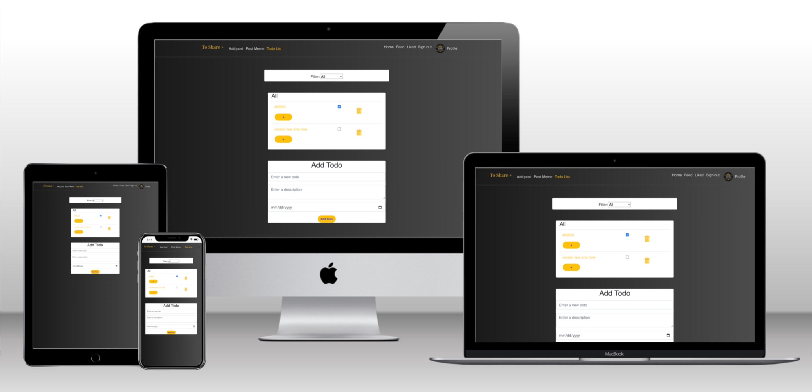
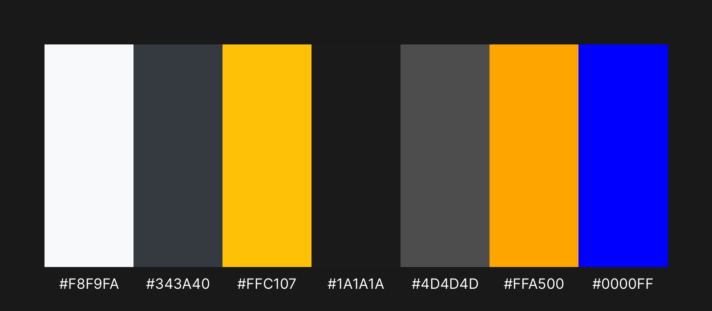
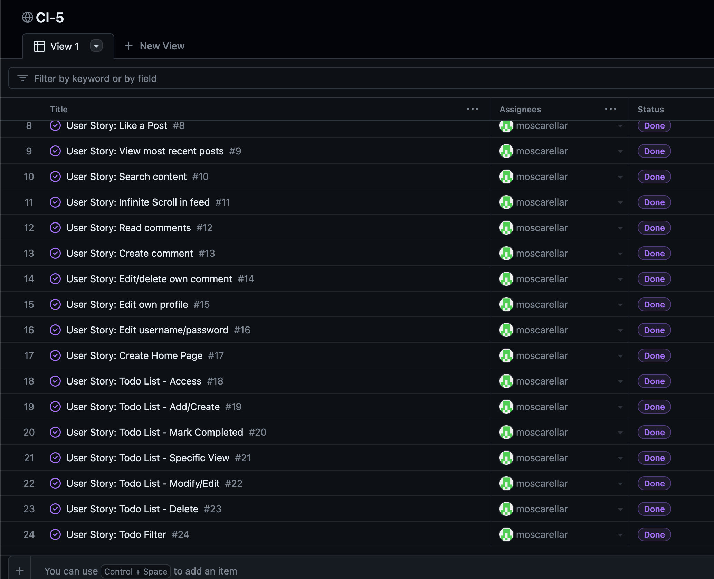

# To Share + - Frontend React application - 3rd Submission Attempt

[Live link](https://ci-p5.herokuapp.com/)
[Back End Documentation and repository](https://github.com/moscarellar/drf-api)

To Share + began as MyFilmApp. It was initially a Film Blog. After some improvements and other requirements: TO DO List have been implemented and is the focus of this App. 
However,  you can also find a variation of the traditinal Post. Now we can render the Post in a different way, so you can create Memes as well.

This project was developed within the Diploma in Software Development (Advanced Front End)

# Table of Contents

- [MyFilmApp - Frontend React application Live link](https://ci-p5.herokuapp.com/)
- [Project Goals](#project-goals)
- [Updates](#updates)
- [User Experience](#user-experience)
  - [User Stories](#user-stories)
    - [User authentication/authorisation & Navigation](#user-authenticationauthorisation--navigation)
    - [Main Feed functionality](#main-feed-functionality)
    - [Post: ADD](#post-add)
    - [Post: Functionality](#post-functionality)
    - [Profile](#profile)
    - [Todo](#todo)
- [Design](#design)
  - [Color Scheme](#color-scheme)
  - [Color Palette](#color-palette)
  - [Wireframes](#wireframes)
- [Agile](#agile)
- [Technologies](#technologies)
  - [Languages](#languages)
  - [Programs, libraries, frameworks and dependencies](#programs-libraries-frameworks-and-dependencies)
- [Testing](#testing)
  - [Testing of implemented User Stories](#testing-of-implemented-user-stories)
- [Deployment](#deployment)
  - [Development](#development)
  - [API Deployment](#api-deployment)
- [Components](#components)
  - [Components in our project](#components-in-our-project)
- [Improvements and Bugs](#improvements-and-bugs)
- [Acknowledgements](#Acknowledgements)

# Project Goals

The goal for this project was to work on Project Example Idea 1: Content platform, which includes all the basic functionality in order for potential visitors to start using the website in its intended way. These features include:

- The platform should enable users to CRUD.
- Content should be searchable.
- Authentication/authorization functionality
- Easy and clear navigation within the whole page
- Possibility to change profile information (bio text, image)

# Updates

After two failing attempts I have deeply considered the requirements and feedbacks provided in past 2 attempts. As a result of this analysis I worked on the following improvements:

- Focus on a Todo List as main improvement of the App.
- Solve issue with rendering Meme in Post Meme.
- Work in a different color palette for a consistent and coherent deign.

The following actions were taken as result of the feedback provided on both past attempts: 

| Criterion | Meets Criterion | Reason                                                                                     | Solution                                                                                  |
|-----------|-----------------|---------------------------------------------------------------------------------------------|-------------------------------------------------------------------------------------------|
| 1.1       | No              | Design of the site is based too heavily on course materials                                | Provide more original design elements and minimize reliance on course materials.            |
| 2.2       | No              | The design section contains the color scheme but the wireframes, mockups, or diagrams are not included. | Include wireframes, mockups, or diagrams in the design section                              |
| 3.10      | No              | Manual testing steps are missing or lacking in any meaningful detail for the Back-End application | Add detailed manual testing steps for the Back-End application                              |
| 3.14      | No              | The deployment process is missing, or lacking in any meaningful detail                      | Include a clear and detailed deployment process                                             |
| 1.1       | No              | The meme records are not getting created from the UI. Design of the site is based too heavily on course work | Investigate and fix the issue causing meme records not to be created from the UI            |
| 3.2       | No              | There are an insufficient number of custom models present and/or custom models present are limited in scope to those present on the course walkthrough project and are not indicative of abilities with custom model design. | Create more custom models that showcase a wider range of abilities in custom model design |

# User Experience

## User Stories

### 1. User authentication/authorisation & Navigation
- As a user I can create a new account
- As a user I can sign in to the app
- As a user I can view a navbar from every page

### 2. Main Feed functionality
- As a user I can view all the most recent posts
- As a user, I can search for posts with hashtag keywords
- As a user, I can see who posted and check their profile

### 3. Post: ADD
- As a logged in user I can create posts

### 4. Post: Functionality
- As a user I can view the posts page
- As a logged in post owner I can edit my post title and description
- As a logged in user I can add comments to a post
- As an owner of a comment I can edit my comment

### 5. Profile
- As a logged in user I can edit my profile (change my profile picture and bio)
- As a logged in user I can update my username and password

### 6. Todo 
- As a logged in user I can access my Todo List
- As a logged in user I can perfrom CRUD actions over my Todo List
- As a logged in user I can access the Specific View of the Todo List
- As a logged in user I can Edit the contents of the Todo List
- As a logged in user I can filter my Todos in Active, Completed, All

# Design

## Color Scheme
The main colors used throughout the page are closely aligned to clean code, with white and simple design.

## Color Palette

In the context of a meme sharing and to-do list app, the chosen color palette of F8F9FA, 343A40, FFC107, 1A1A1A, 4D4D4D, FFA500 (Orange), #808080 with 84726e for better contrast, and 0000FF (Blue).

### Color Usage

The color palette has been carefully chosen to provide visual appeal and emotional response. On the Todo List, the background colors are white for a clearer contrast, as it's focus is on reading only, with no visual stimulus from posts. 

## Wireframes

Please, find the first version of my Wireframes. I did use this initial Wireframes for reference. Done with [Balsamiq](https://balsamiq.com).

<b>Wireframes - Feed</b>

 

<b>Wireframes - Signin</b>

 

<b>Wireframes - SignUp</b>

 

<b>Wireframes - ToDo</b>

 

<b>Wireframes -  Post Meme </b>

 

# Agile

For this project the GitHub Kanban agile project management tool was used to create User Stories

[Click here to check the board](https://github.com/users/moscarellar/projects/1)

# Technologies

## Languages

- [HTML](https://en.wikipedia.org/wiki/HTML5)
- [CSS](https://en.wikipedia.org/wiki/CSS)
- [JavaScript](https://www.w3schools.com/js/js_es6.asp)
- [JSX](https://reactjs.org/)

## Programs, libraries, frameworks and dependencies

- [Gitpod](https://gitpod.io)
- [GitHub](https://github.com/)
- [React 17](https://17.reactjs.org/)
- [React-Bootstrap 1.6](https://react-bootstrap-v4.netlify.app/)
- [Heroku](https://id.heroku.com/login)
- [Google Fonts](https://fonts.google.com/)
- [Font Awesome](https://fontawesome.com/)

# Testing

The W3C Markup Validator, W3C CSS Validator Services and ESLint were used to validate the code.

- [W3C Markup Validator](https://validator.w3.org/)
- [W3C CSS Validator](https://jigsaw.w3.org/css-validator/)

## Testing

## User authentication/authorisation & Navigation
User authentication/authorisation & Navigation

### Expected results
- Users with invalid credentials should be denied access
- Users with valid credentials should be granted access

## Main Feed functionality
Main Feed functionality

### Expected results
- Posts should be displayed in reverse chronological order
- Posts should be displayed with the correct author and timestamp

## Adding a post
Adding a post

### Expected results
- Unauthenticated users should be denied access to the "Add Post" page
- Authenticated users should be able to add posts, which should then be displayed on the main feed

## Post page functionality
Post page functionality

### Expected results
- Users should be able to view individual posts
- Users should be able to like and comment on posts

## Profile page functionality
Profile page functionality

### Expected results
- Users should be able to view their own profile page
- Users should be able to view other users' profile pages

## Todo List funcionality
Todo List functionality

### Expected results
- Users should be able to view their todo list
- Users should be able to perform CRUD actions

# Deployment

## Development

Development
1. Clone the CI repository.
2. Open your IDE and navigate to the repository. Install dependencies using the command "npm install".
3. In the project, locate the file axiosDefaults.js. This file contains the API endpoint for the DRF API. Replace the existing URL with the URL of the deployed DRF API.
4. Make any necessary changes to the project code.
5. Use Git to add, commit, and push all changes to your repository.

Deployment
1. Create a Heroku account or log in to your existing account.
2. Create a new application on Heroku.
3. Connect the Heroku application to your Git repository by following the instructions provided in the Heroku dashboard.
Set up any necessary environment variables in the Heroku app settings.
4. In the Heroku dashboard, go to the "Deploy" tab.
Under the "Deployment method" section, select "GitHub" as the deployment method.
5. Choose the repository and branch you want to deploy.
6. Enable automatic deploys if desired.
7. Click the "Deploy Branch" button to deploy the app to Heroku.
8. Once the app is deployed, click the "Open app" button in the Heroku dashboard to view the live application.

## API Deployment

API Deployment Details:

Server Infrastructure: Heroku used for this task.

In order to deploy this app I went to Heroku https:heroku.com/apps

1. Create a New App

We must click new and create new app.

<b>Create New App</b>

 

2. Name and Region

Choose a name for your app and choose a region as well.

<b>Create App</b>

 

3. Deploy Tab

Find Deploy Tab, click on it.

<b>Deploy</b>

 

4. Connect to Github

Connect to Github so we can choose our repository to deploy.
Search repository by name. After is found click on the deploy button.

<b>Connect</b>

 

Environment Configuration: We need to configure variables, network settings, and install dependencies that will help us connect with the API securely.

The Axios file we find in the project, is a JavaScript library used to make HTTP requests. We will use it to make requests to the deployed API from our React application.

# Components

The components are designed to be reusable, which means they can be used in different applications or systems. 

## Components in our project

Asset.js: This component is used to display an asset, such as an image or video. It accepts props like src, alt and className.

MoreDropdown.js: This component provides a dropdown menu that can be triggered by clicking on a button. It accepts an array of options that are rendered as clickable items in the dropdown menu.

NavBar.js: This component is used to render a navigation bar with customizable links and styles. It accepts an array of links, each with a label and a URL.

Avatar.js: This component is used to display an avatar image with an optional label or icon.

Reusable components will help us:

Faster development: Reusable components reduce development time and effort by providing pre-built, tested, and ready-to-use functionality.

Improved software quality: Reusable components are tested, validated, and proven to work. This reduces the risk of errors and bugs in the software, and improves overall software quality.

# Improvements and Bugs

This project will turn into a Common Placebook after this evaluation is finished.
During the evolution of the project, the Todo List was implemented. After some time developing this feature, I came with the idea of a Common Placebook, which is a way to store knowledge. 

This will requiere of Searching implementation into the todo list.
Also, categories are needed in order to store the knowledge by categories.

More usage of animations and beautiful UI is on my interest, that is one of the reasons of Lottie usage in the project. In the future I would like to do more interactive animations.

At the moments, I have not found any bugs.

## Acknowledgements

I would really like to appreciate the Student Support team. 
Specially to the tutoring service, which I heavily used on the last months to develop this project. Also, big THANK YOU, to student support for understanding my case and providing support so I could finish my Diploma!